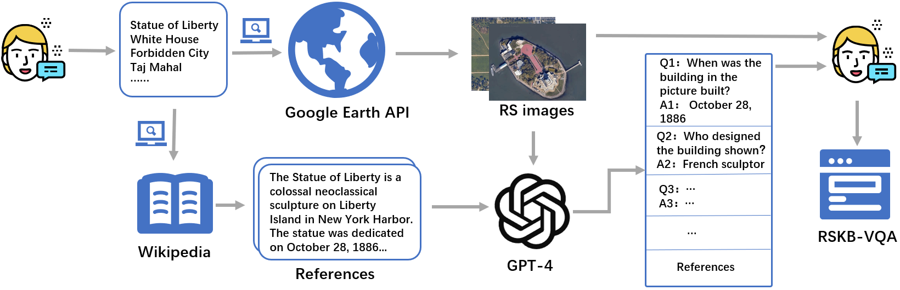

# RSKB-VQA
 - [*Retrieval Augmented Large Vision-Language Models For Remote Sensing Visual Question Answering*]

>In this paper, we introduce the Remote Sensing Knowledge-Based Visual Question Answering dataset (RSKB-VQA), pioneering the integration of retrieval-augmented techniques into the remote sensing VQA task. We further develop a multi-stage retrieval question-answering framework and train a cross-modal retriever, employing the Chain of Thought (COT) approach to decompose the retrieval task, enabling the extraction of external knowledge at various scales. 


## Data generation

 ## Model Architecture


## Dataset
- ```image```
- ```Question```
- ```Refernece```
- ```Answer```
## 📕 Code Path

#### Code Structures
There are four parts in the code.
- **data**: It contains the RSKB-VQA dataset.
- **data_generation**: It contains the code for data generation process.
- **vlm**: It contains the code for ulti-stage retrieval question-answering framework with LLaVA.
- **retreval**: The training scripts for Structure-CLIP.


```plain
.
├── README.md
├── data/
    ├── images/               
    ├── images_1/
    ├── images_2/
    ├── image_QA.json/
├── data_generation/
├── vlm/
├── retreval/
```


## 🔬 Dependencies

- ```Python 3.11```
- ```PyTorch >= 2.1.0```
- ```Transformers>= 4.37.2```
- ```Deespeed == 0.12.6```
- ```fastpai```
- ```NumPy```
- ```Peft```
- ```langchian```
- All experiments are performed with one A100 GPU.

### [Parameter](#content)

We choose a pre-trained CLIP model and train it for 10 epochs with a batch size of 128 on a single NVIDIA A100 GPU (80GB). We choose a unified prompt template during the inference of VLMs, with the temperature setting of 0.3 and no down-sampling.

## Acknowledgment
This repo is built upon the following work:
```
Structure-CLIP: Towards Scene Graph Knowledge to Enhance Multi-modal Structured Representations.Yufeng Huang 1 *, Jiji Tang 3 *, Zhuo Chen 2, Rongsheng Zhang 2,3, Xinfeng Zhang 3, Weijie Chen3, Zeng Zhao 3, Zhou Zhao 2, Tangjie Lv,3, Zhipeng Hu 3, Wen Zhang
https://github.com/zjukg/ Structure-CLIP
```
```
“Visual Instruction Tuning.”  Liu, Haotian, Chunyuan Li, Qingyang Wu, YongJae Lee, -Madison -Madison, and Microsoft Research. n.d. 
https://llava-vl.github.io
```
